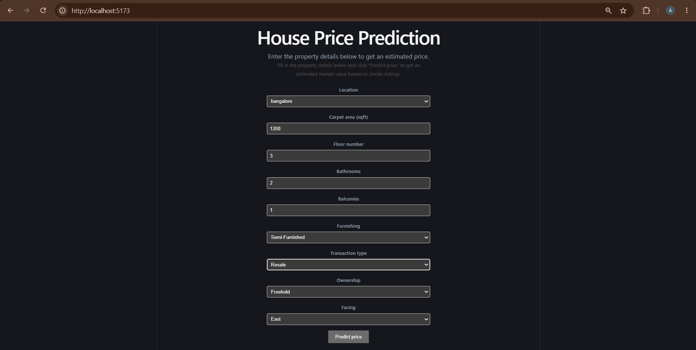
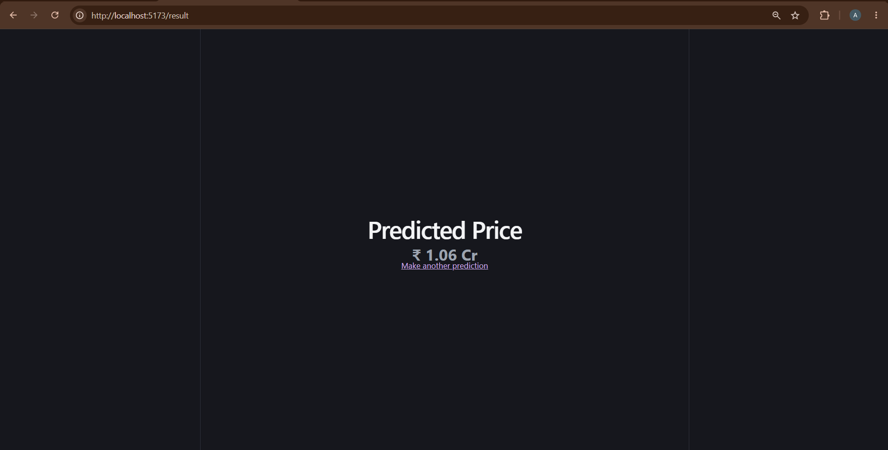
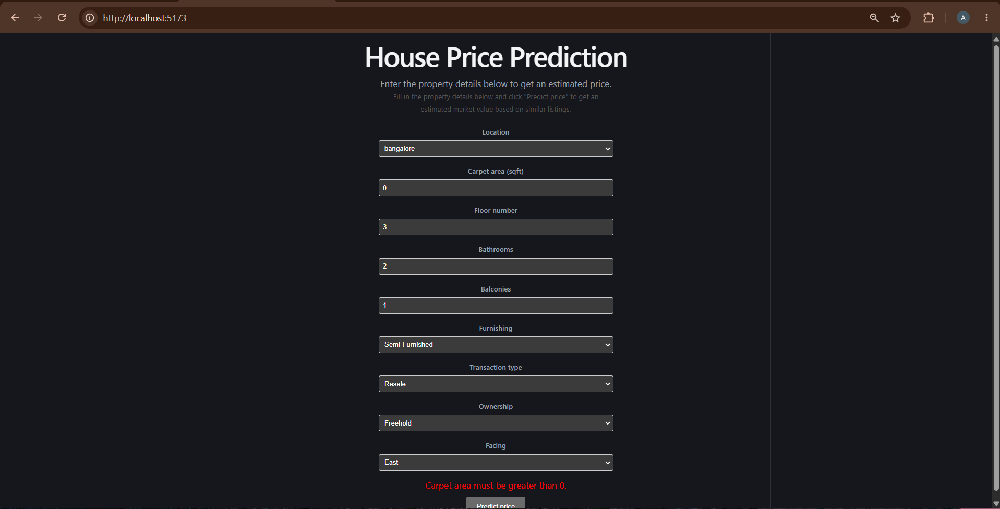
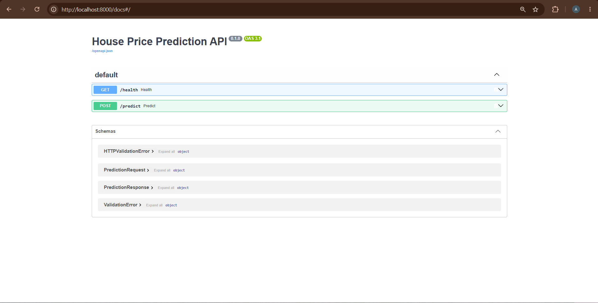

# House Price Prediction — End-to-End ML Web App

Predicts Indian house prices from property details (area, floor, bathrooms, furnishing, etc.) using a trained ML model, served through a FastAPI backend and a React frontend.

## How it works
React Form → FastAPI /predict → RandomForest model (.pkl) → Predicted price

> FYI: `.pkl` (pickle) is a file format for saving a trained Python object

The model was trained in a Jupyter notebook on the [House Price dataset](https://www.kaggle.com/datasets/juhibhojani/house-price) from Kaggle.

## Features

- Cleans and processes around 187,000 real property listings from India
- Compares 3 regression models (Linear Regression, Gradient Boosting, Random Forest)
- Serves predictions through a REST API
- Simple React form for entering property details and viewing the predicted price

## Tech Stack

Python, pandas, scikit-learn (model) - FastAPI (backend) - React + TypeScript + Vite (frontend)

## Project Structure
notebooks/ → data cleaning, training, model export
backend/ → FastAPI app that serves predictions
frontend/ → React form + result page

## Prerequisites

Install and verify each of these before starting:

|       Tool       | Minimum version |       Check with       |
|------------------|-----------------|------------------------|
| Python           |       3.11      | `python --version`     |
| Node.js + npm    |        18       | `node --version`       |
| A Kaggle account |        –        | https://www.kaggle.com |

## Setup

### 1. Get the dataset & train the model

Open a terminal at the **project root** (the top-level `house-price-project` folder).

Install the Kaggle CLI:
```bash
pip install kaggle
```

Get your Kaggle API token:
1. Go to https://www.kaggle.com → click your profile picture (top right) → **Settings** → **API Tokens**
2. Click **Generate New Token** — Kaggle will show you a **key** (looks like `KGAT_xxxxxxxxxxxxxxxxxxxxxxxxxxxxxxxx`)
   >  **Copy this immediately** — Kaggle only shows the key once and will not display it again.
3. Your **username** is shown on your Kaggle profile/account page (not in the token popup) — find it there.
4. Combine both into a `kaggle.json` file yourself using the command for your terminal:

   > Check which terminal you're in: if your prompt shows `PS C:\Users\you>` you're in PowerShell (VS Code's default on Windows); if it just shows `C:\Users\you>` you're in Command Prompt (cmd).
   > `%USERPROFILE%` (cmd) and `$env:USERPROFILE` (PowerShell) are environment variables that point to your Windows user folder (e.g. `C:\Users\Ali`) — used instead of typing the path manually so the command works on any machine regardless of username.

   **PowerShell:**
```powershell
   echo '{"username":"your-username","key":"your-key"}' > $env:USERPROFILE\.kaggle\kaggle.json
```

   **Command Prompt (cmd):**
```cmd
   echo {"username":"your-username","key":"your-key"} > %USERPROFILE%\.kaggle\kaggle.json
```

   **macOS/Linux:**
```bash
   echo '{"username":"your-username","key":"your-key"}' > ~/.kaggle/kaggle.json
```

Still from the project root, download the dataset:
```bash
kaggle datasets download -d juhibhojani/house-price -p notebooks/data --unzip
```

Install the packages needed to run the notebook:
```bash
pip install jupyter pandas numpy scikit-learn matplotlib seaborn joblib
```

Open `notebooks/house_price_model.ipynb` (in VS Code, or run `jupyter notebook` from inside the `notebooks/` folder) and run it **top to bottom**. This produces two files inside `notebooks/`: `house_price.pkl` and `locations.json`.

Move both files into place:
- `house_price.pkl` → `backend/models/house_price.pkl` (create the `models` folder if it doesn't exist)
- `locations.json` → `frontend/src/locations.json`

> `house_price.pkl` isn't included in this repo (it's ~346MB, over GitHub's 50MB limit) — you must generate it yourself using the steps above.

> **Note:** the backend requires the exact scikit-learn version used in training (see `requirements.txt`) — a version mismatch can cause the pickle to fail to load.

### 2. Backend

Open a **new terminal** and navigate to the `backend` folder from the project root:
```bash
cd backend
```

Create and activate a virtual environment:
```bash
python -m venv .venv
.venv\Scripts\activate
```
*(macOS/Linux: `source .venv/bin/activate` instead)*

You should see `(.venv)` appear at the start of your terminal line, confirming it's active.

Install the backend's dependencies:
```bash
pip install -r requirements.txt
```

Start the server:
```bash
uvicorn app.main:app --reload
```

Leave this terminal open and running. The API is now live at `http://localhost:8000` (interactive docs at `http://localhost:8000/docs`).

To run the backend tests instead (in a separate terminal, with `.venv` activated the same way):
```bash
pytest
```

### 3. Frontend

Open **another new terminal** (keep the backend one running) and navigate to `frontend` from the project root:
```bash
cd frontend
```

Install dependencies:
```bash
npm install
```

Create a `.env` file in the `frontend` folder (copy `.env.example` and rename the copy to `.env`), containing:
VITE_API_BASE_URL=http://localhost:8000

Start the frontend:
```bash
npm run dev
```

Open the URL it prints (usually `http://localhost:5173`) in your browser. With both the backend and frontend running, fill out the form and click **Predict price** to see a real prediction.

## Environment Variables

Frontend (`frontend/.env`):

- `VITE_API_BASE_URL` — base URL of the backend API (e.g. `http://localhost:8000`)

See `frontend/.env.example` for a template.

## API Example

```bash
curl -X POST http://localhost:8000/predict \
  -H "Content-Type: application/json" \
  -d '{"location":"bangalore","carpet_area_sqft":1200,"floor_num":3,"bathroom":2,"balcony":1,"furnishing":"Semi-Furnished","transaction":"Resale","ownership":"Freehold","facing":"East"}'
```
Response: `{ "predicted_price": 10621500 }`

## Model Performance

| Model                      | MAE        | RMSE      | R²        |
|----------------------------|------------|-----------|-----------|
| **Random Forest (chosen)** | 1,354,452  | 5,705,804 | **0.826** |
| Gradient Boosting          | 3,195,780  | 6,771,222 | 0.755     |
| Linear Regression          | 4,687,508  | 8,890,567 | 0.578     |

`Random Forest had the best performance and was used for the final model.`

## Screenshots




